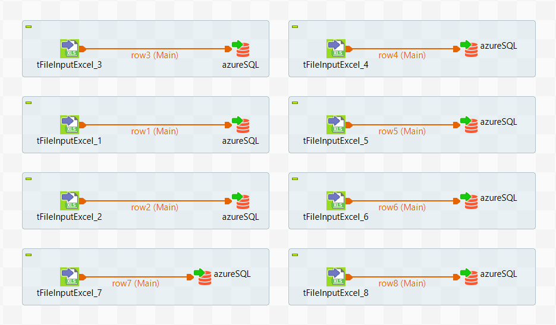
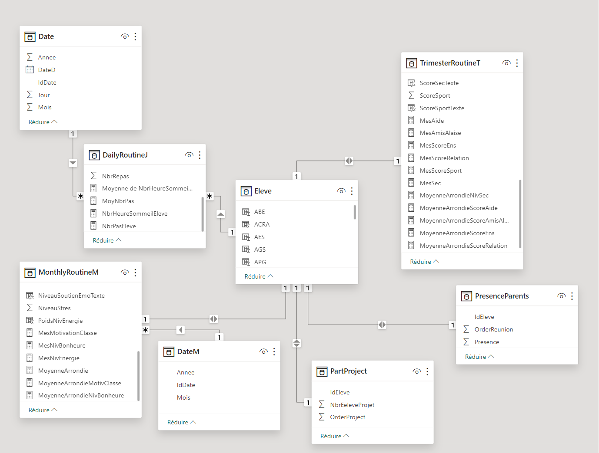
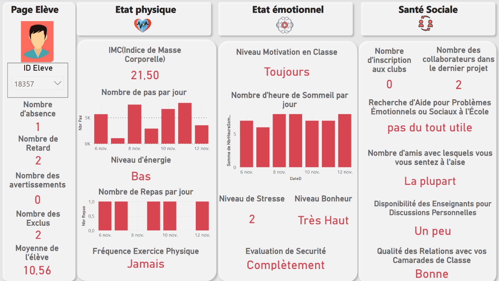
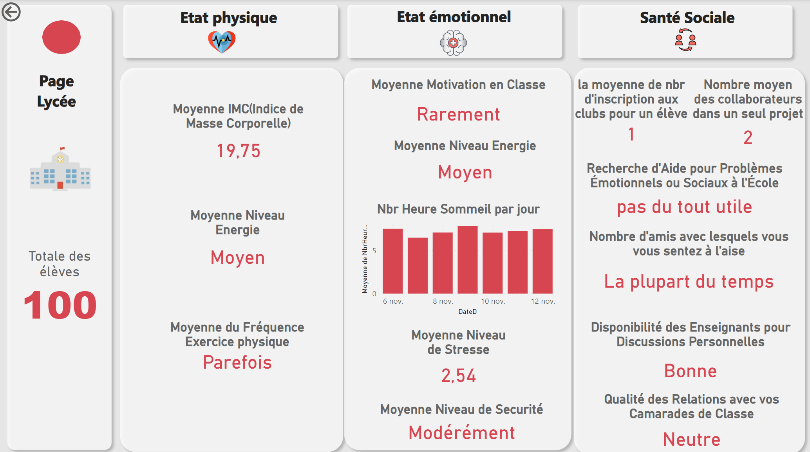
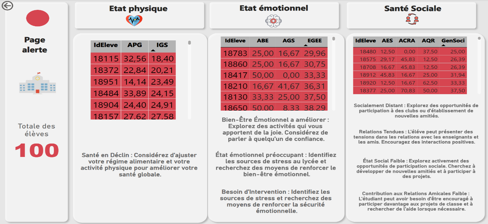
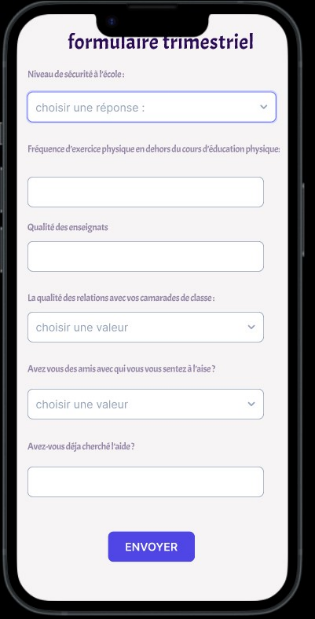
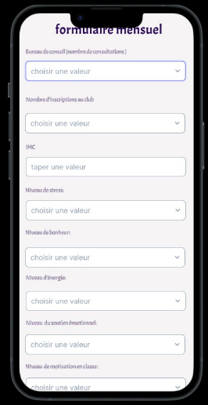

# IEEE-ENETCOM-SB-SMC-EDSOC-CHALLENGE

Welcome to SMC CHALLENGE
## Intégration des données : 

Les fichiers Excel ont été chargés dans une base de données Azure SQL, utilisant l’outil Talend. Voila la conception du job Talend  

  

## Création du Rapport Power BI : 

Les données extraites d'Azure SQL ont été exploitées pour créer un rapport visuel dynamique à l'aide de L’outil Power BI.
 
**Modélisation des données :** 

Avant de visualiser les données, notre choix s'est porté sur une modélisation en constellation qui a façonné notre configuration finale. Cette structure solide et efficace constitue la base de notre système pour l'analyse et la représentation des informations collectées

  

**Visualisation des données :** 

Ce rapport présente des graphiques visuels et sera composé de 3 pages :
Une page dédiée à l'état des élèves. On peut accéder à l'état de chaque élève existant dans ma base de données en utilisant son ID grâce à la mise en place d'un filtre. Ainsi, on peut visualiser individuellement les états sociaux, émotionnels et physiques.

  

La deuxième page sera consacrée à l'analyse globale des données du lycée choisi. 

  

La troisième page sera dédiée à la prise de décision et à la formulation de recommandations pour améliorer les états.

## Exploration des indicateurs clés  : 

Notre analyse repose sur une approche analytique stratégique, explorant les KPIs essentiels et en élaborant des formules combinatoires pour guider la prise de décision. Cette méthodologie permet non seulement d'évaluer l'état actuel de l'école, mais aussi d'identifier clairement les axes d'amélioration. De plus, elle met en place des alertes pour signaler les situations critiques concernant les élèves, renforçant ainsi la capacité proactive du système. 

  

## Application Mobile de Collecte de Données :

Une application mobile a été développée pour suivre le comportement quotidien, mensuel et trimestriel des élèves et automatiser le processus de collecte de données. 

  
  

